# MDBZ01 BE 구현 흐름 (서버 처리)

## 1. 컴포넌트 구성

> 공통 레이어 역할 정의 → [_common/be-layer-pattern.md](../_common/be-layer-pattern.md)

| 클래스명 | MDBZ01 특이사항 |
|---|---|
| `MDBZ01Controller` | `@RequestMapping("/{bizSeq}/mdbz01/bizs")`. `/tpl` 경로에 GET/POST/PUT/PATCH 4개 메서드 공존 — HTTP 메서드로만 구분 |
| `MDBZ01Comp` | 사업장 저장 시 multipart 파일 처리 분기 포함. 물류대행 관련 일부 검증 블록이 현재 주석 처리 상태 |
| `MDBZ01TxComp` | `saveBizCenterTX` 하나의 메서드에 insert·update·delete 3가지 경로가 모두 포함되어 있음 |
| `MDBZ01Dao` | `insertBizCenter` SQL이 자사 센터 등록과 위탁 신청 두 경로 모두에서 공유됨 |

---

## 2. 업무 목록

| 업무명 | HTTP + 경로 |
|---|---|
| 수정 가능 사업장 목록 조회 | `GET /{bizSeq}/mdbz01/bizs/editable/bizs/{regBizSeq}` |
| 사업장 단건 조회 | `GET /{bizSeq}/mdbz01/bizs/{selectedBizSeq}` |
| 사업장 수정 | `POST /{bizSeq}/mdbz01/bizs` |
| 물류센터 목록 조회 | `GET /{bizSeq}/mdbz01/bizs/{selectedBizSeq}/centers` |
| 물류센터 저장 (등록·수정·삭제) | `PUT /{bizSeq}/mdbz01/bizs/centers` |
| 대행의뢰신청업체 조회 **(FE 미연결)** | `GET /{bizSeq}/mdbz01/bizs/{selCenterSeq}/tplReq` |
| 의뢰 수락/거절 **(FE 미연결)** | `PATCH /{bizSeq}/mdbz01/bizs/{selBizSeq}/tplReq` |
| 대행센터지정 팝업 조회 | `GET /{bizSeq}/mdbz01/bizs/tpl` |
| 대행센터지정 수정 | `PATCH /{bizSeq}/mdbz01/bizs/tpl` |
| 물류대행업체 검색 (팝업) | `POST /{bizSeq}/mdbz01/bizs/tpl` |
| 대행 의뢰 신청 | `PUT /{bizSeq}/mdbz01/bizs/tpl` |
| 의뢰 취소 (의뢰자) **(FE 미연결)** | `PATCH /{bizSeq}/mdbz01/bizs/cancel` |

---

## 3. 업무별 시퀀스 다이어그램

### 3-1. 수정 가능 사업장 목록 조회

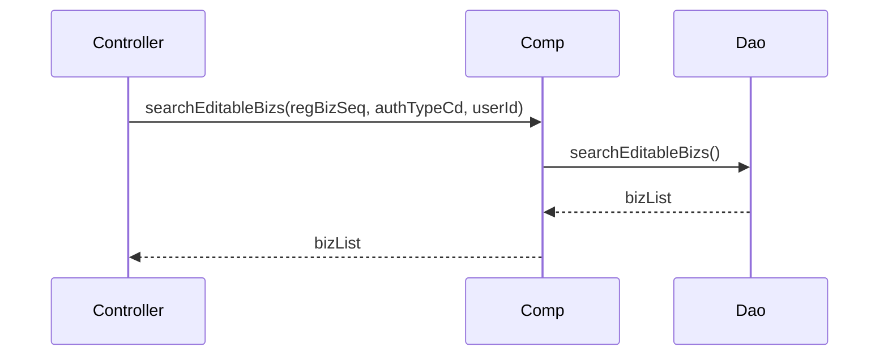

### 3-2. 사업장 단건 조회

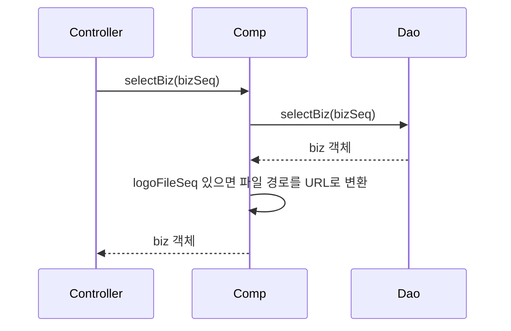

### 3-3. 사업장 수정

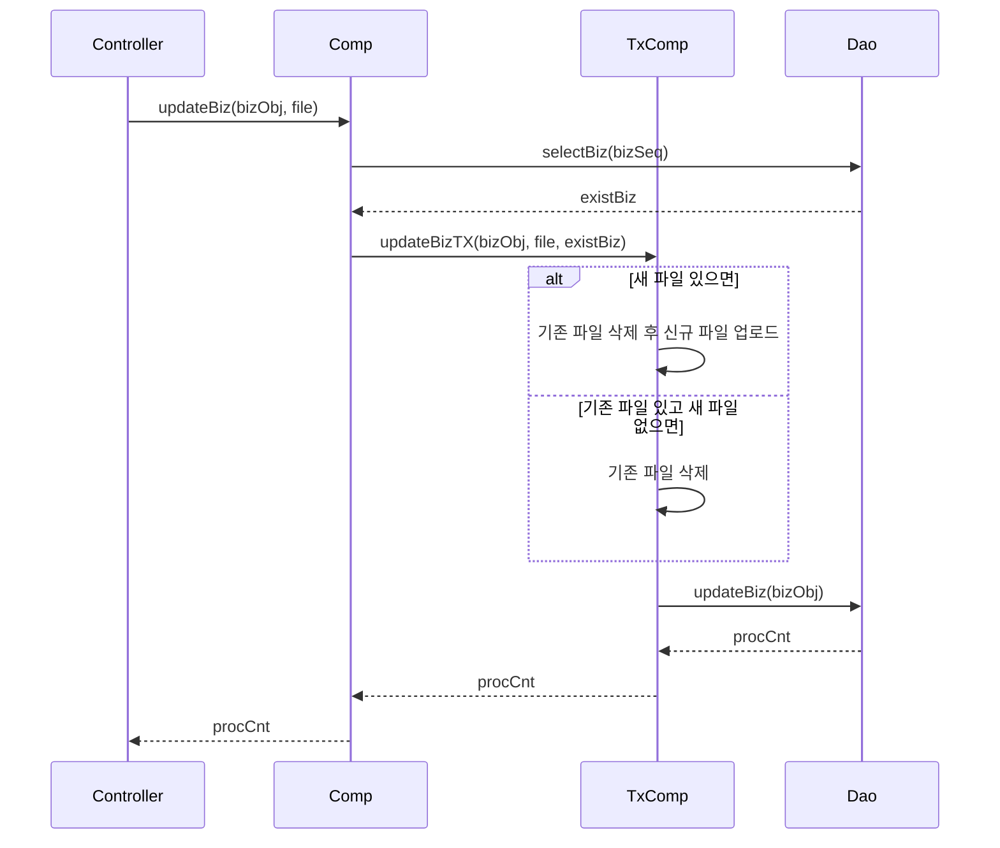

### 3-4. 물류센터 목록 조회

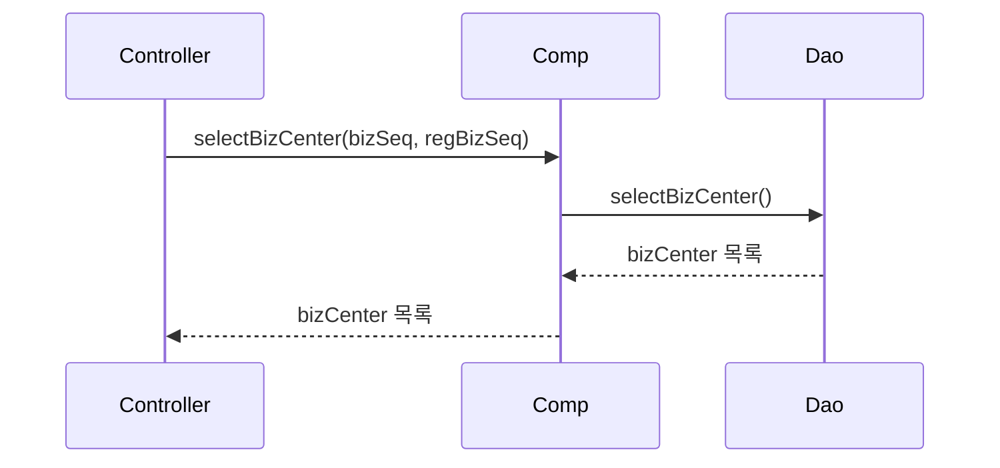

### 3-5. 물류센터 저장 (등록·수정·삭제)

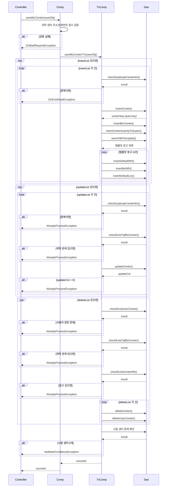

### 3-6. 대행의뢰신청업체 조회

**주의: 이 플로우는 현재 FE Vue 화면에 연결되어 있지 않으며, [mdbz01-99-issues.md](./mdbz01-99-issues.md)의 ISSUE-01을 참조한다.**

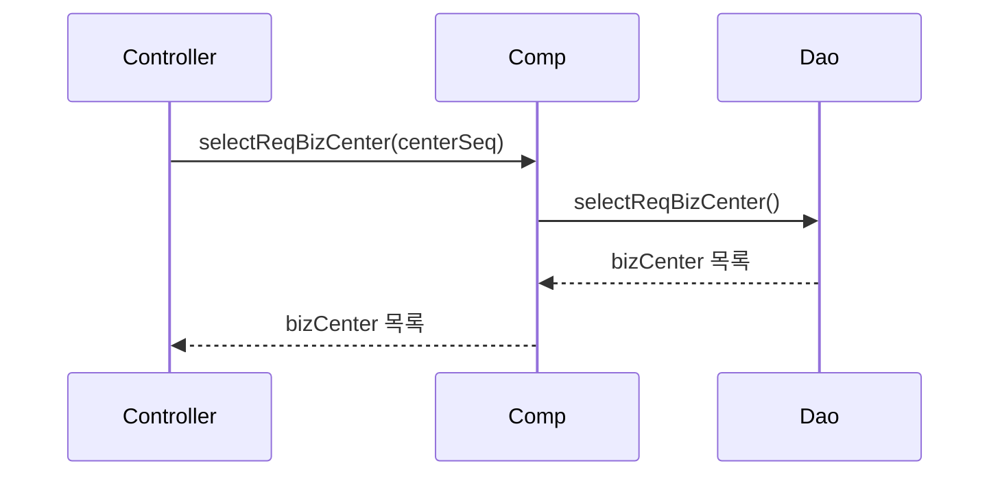

### 3-7. 의뢰 수락/거절

**주의: 이 플로우는 현재 FE Vue 화면에 연결되어 있지 않으며, [mdbz01-99-issues.md](./mdbz01-99-issues.md)의 ISSUE-01을 참조한다.**

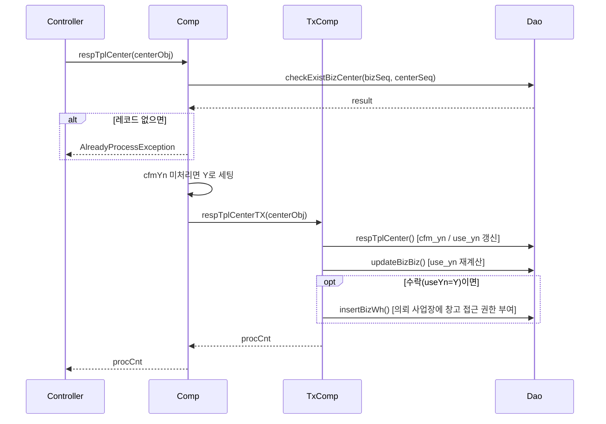

### 3-8. 대행센터지정 팝업 조회

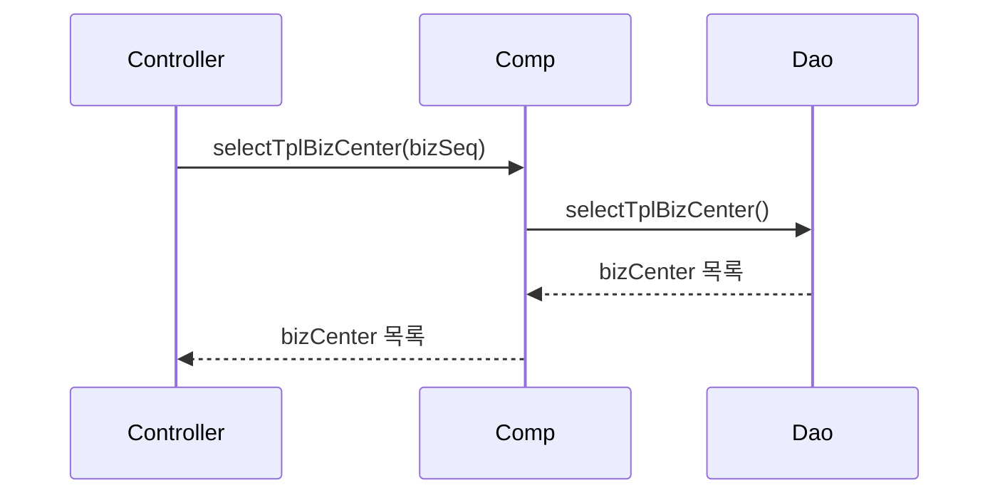

### 3-9. 대행센터지정 수정

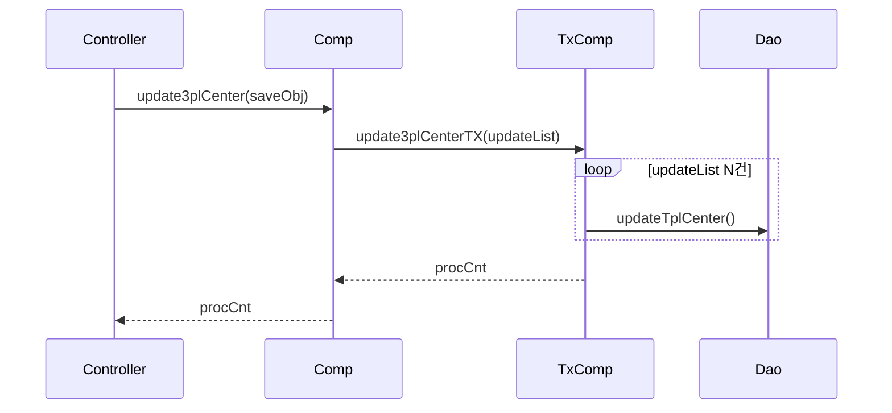

### 3-10. 물류대행업체 검색 (팝업)

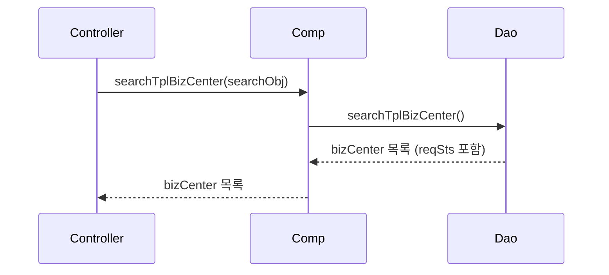

### 3-11. 대행 의뢰 신청

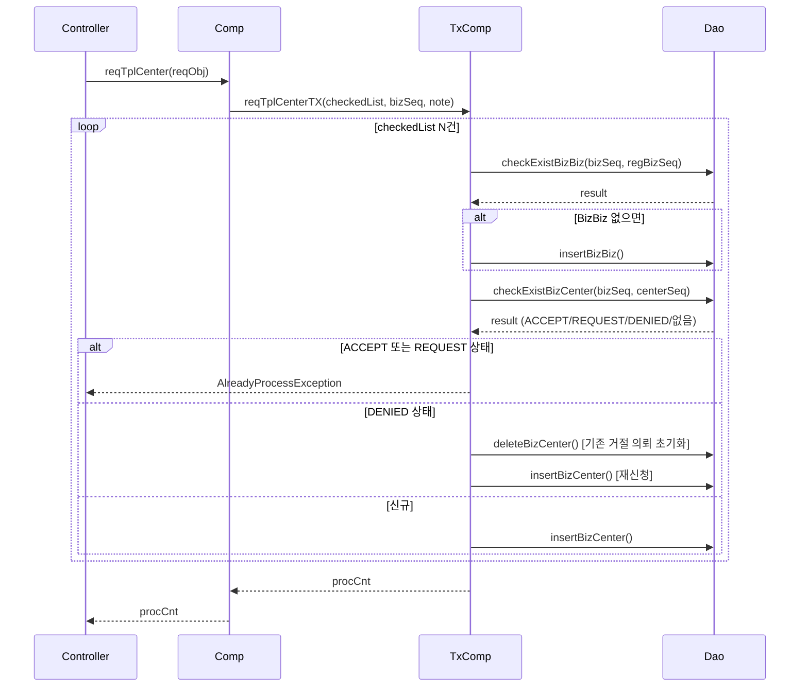

### 3-12. 의뢰 취소 (의뢰자)

**주의: 이 플로우는 현재 FE Vue 화면에 연결되어 있지 않으며, [mdbz01-99-issues.md](./mdbz01-99-issues.md)의 ISSUE-01을 참조한다.**

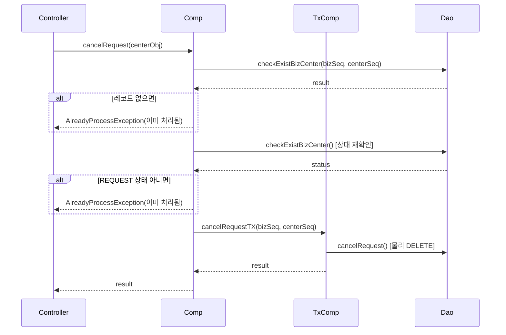

---

## 4. 예외 처리 목록

| 발생 조건 | 예외 클래스 | 응답 메시지 |
|---|---|---|
| 위탁 센터 등록·수정 시 주소·주소상세·전화번호 누락 | `ZinBadRequestException` | 주소, 주소상세, 전화번호는 필수입니다 |
| 센터 등록 시 사업장 내 센터명 중복 | `ZinExistDataException` | 센터명이 중복됩니다 |
| 센터 수정 시 사업장 내 센터명 중복 | `AlreadyProcessException` | 센터명이 중복됩니다 |
| 센터 수정·삭제 시 위탁 업체 연결됨 | `AlreadyProcessException` | 위탁업체가 존재합니다 |
| 센터 삭제 시 사용자 권한 잔존 | `AlreadyProcessException` | 권한센터가 존재합니다 |
| 센터 삭제 시 창고 잔존 | `AlreadyProcessException` | 창고를 먼저 삭제해주세요 |
| 센터 저장 후 사용 중인 센터 0개 | `NotMeetConditionsException` | 하나 이상의 센터가 사용되어야 합니다 |
| 센터 수정 결과 0건 | `AlreadyProcessException` | 데이터가 존재하지 않습니다 |
| 의뢰 수락/거절 시 대상 미존재 | `AlreadyProcessException` | 요청하신 데이터를 찾을 수 없습니다 |
| 의뢰 취소 시 대상 미존재 | `AlreadyProcessException` | 이미 처리되었습니다 |
| 의뢰 취소 시 이미 ACCEPT 또는 DENIED | `AlreadyProcessException` | 이미 처리되었습니다 |
| 대행 의뢰 신청 시 ACCEPT 또는 REQUEST 상태 | `AlreadyProcessException` | 이미 처리되었습니다 |
| Dao·파일 처리 중 시스템 오류 | `ResponseErrorException` | 시스템 에러 |

---

## 5. 기술 이슈

상세 이슈는 [mdbz01-99-issues.md](./mdbz01-99-issues.md)를 단일 출처(SSoT)로 관리한다.

- 주석 처리된 위탁 관련 코드: `MDBZ01Comp.updateBiz`, `MDBZ01TxComp.updateBizTX` 요약은 `99-issues.md`의 ISSUE-09 참조
- `cancelRequest`의 `checkExistBizCenter` 이중 호출: `99-issues.md`의 ISSUE-03 참조
- 센터 등록 시 창고 템플릿 미존재 엣지케이스: `99-issues.md`의 관련 이슈 참조
- TxComp에 검증·조회·쓰기 로직이 집중된 구조: `99-issues.md`의 구조 개선 항목 참조
