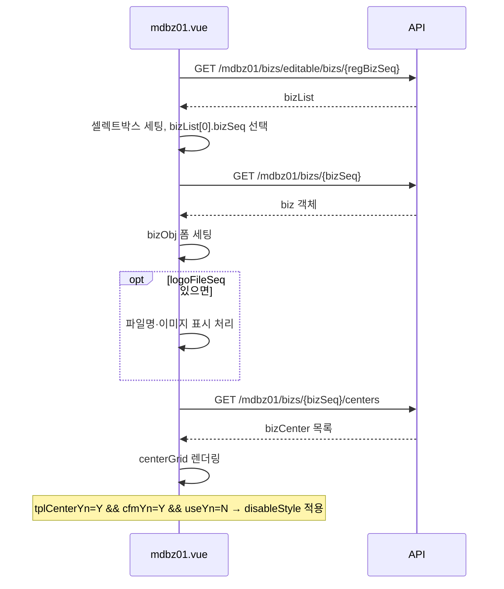
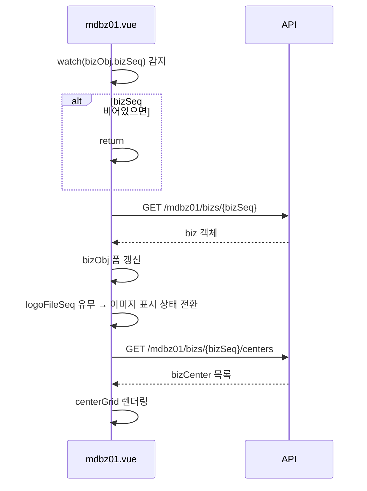
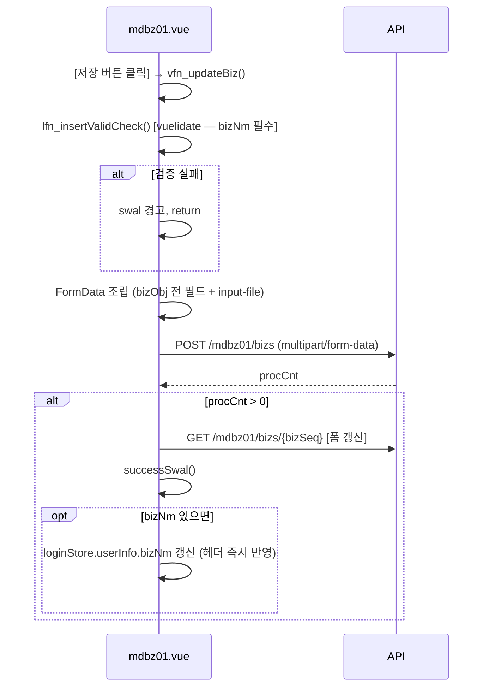
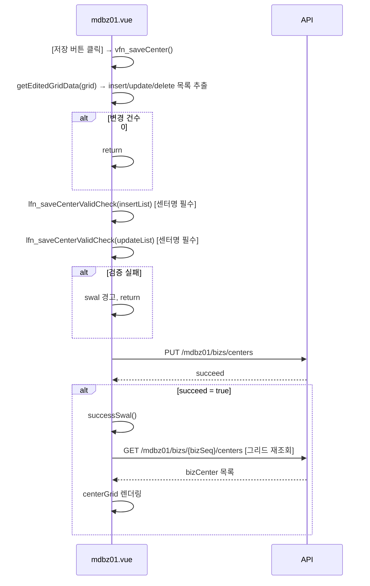
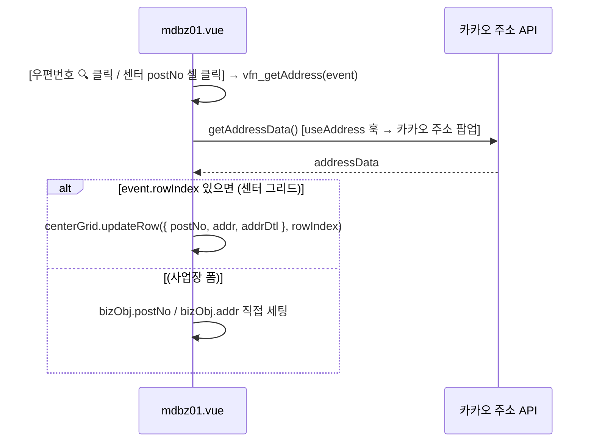
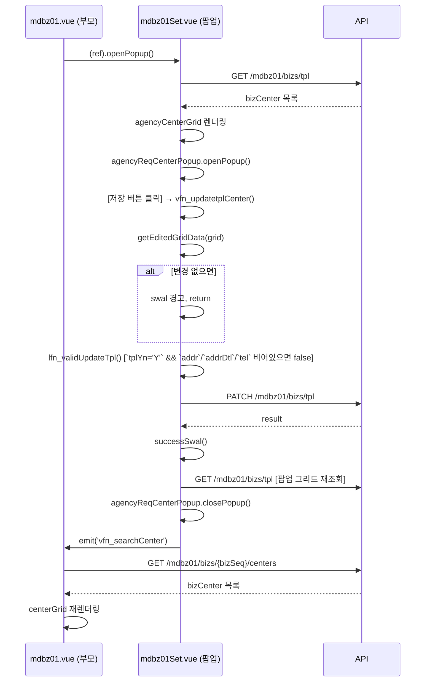
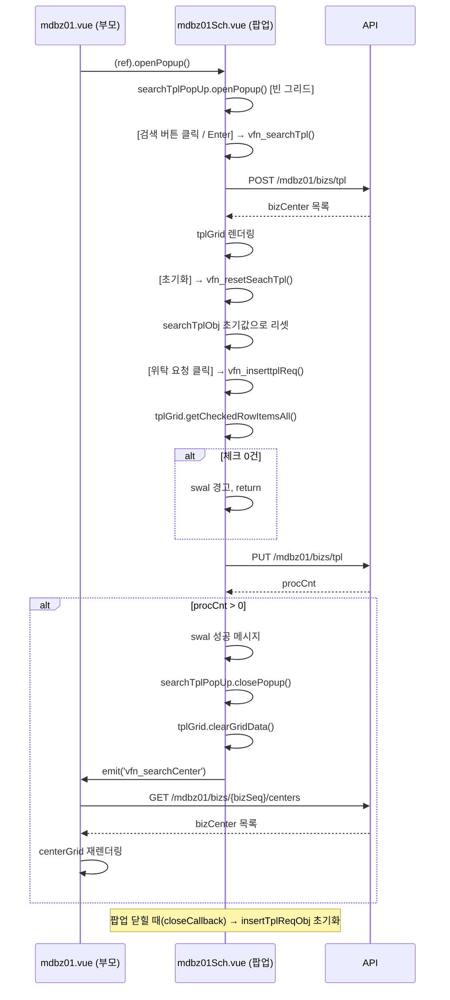

# MDBZ01 FE 구현 흐름 (화면 처리)

> Vue 파일 목록(mdbz01.vue / mdbz01Set.vue / mdbz01Sch.vue) → [02-ui.md §1 화면 목록](./mdbz01-02-ui.md)

---

## 1. 업무별 시퀀스 다이어그램

### 1-1. 화면 초기 진입 — 사업장 목록 조회 및 기본 데이터 세팅

### 1-2. 사업장 셀렉트박스 변경 — 재조회

### 1-3. 사업장 정보 저장

### 1-4. 물류센터 그리드 인라인 편집 저장

### 1-5. 주소 검색 (사업장 폼 / 센터 그리드 셀)

### 1-6. 센터정보수정 팝업 열기 및 저장 (mdbz01Set.vue)

### 1-7. 물류대행업체 검색 및 위탁 요청 팝업 (mdbz01Sch.vue)

---

## 2. 구현 포인트

1. **사업장 셀렉트박스 watch 연동**: `bizObj.bizSeq`를 `watch`로 감시하여 선택 변경 시 `vfn_setBizDetail` → `vfn_searchCenter` 연쇄 호출. `onMounted`도 동일 경로로 초기 데이터 세팅.

2. **사업장 저장 — multipart/form-data**: 이미지 파일 업로드를 포함하므로 `bizObj` 전 필드를 `FormData`로 조립 후 `Content-Type: multipart/form-data`로 POST. 저장 성공 시 `loginStore.userInfo.bizNm` 즉시 갱신.

3. **사업장 이미지 3가지 상태 분기**: `fileShow`(기존 서버 이미지), `isNewFile`(로컬 파일 선택 미리보기), 둘 다 false(no-image 아이콘). `lfn_readInputFile`로 FileReader base64 미리보기 제공.

4. **센터 그리드 인라인 편집 제약**: `cellEditBeginHandler`에서 기존 행 + 위탁센터(`tplCenterYn=Y`)이면 수정 차단(`return false`). 신규 추가 행에만 `inputPossibleStyle` 적용.

5. **센터 그리드 우편번호 셀 클릭 → 카카오 주소 팝업**: `postNo` 컬럼에 `IconRenderer` 사용. `onClick`에서 `vfn_getAddress(event)` 호출 → `event.rowIndex` 기준으로 해당 행 업데이트.

6. **팝업 `defineExpose` 패턴**: `mdbz01Set`, `mdbz01Sch` 모두 `openPopup`만 외부 노출. 부모는 ref로 `openPopup()` 호출.

7. **팝업 → 부모 콜백**: 두 팝업 모두 저장/요청 성공 후 `emit('vfn_searchCenter')`로 부모 센터 그리드 재조회 트리거.

8. **mdbz01Sch `closeCallback`**: `LayerPopup`의 `:closeCallback`에 `lfn_insertpopupCloseCallback` 연결 → 팝업 닫힐 때 `insertTplReqObj` 초기화.

9. **위탁센터 `disableStyle`**: 실제 Vue 구현 기준으로 `tplCenterYn='Y' && cfmYn='Y' && useYn='N'` 행의 `disableStyle` 값에 `gridTxt-disabledStyle`을 지정한다.

10. **`getEditedGridData` 공통 유틸**: `insertList / updateList / deleteList` 분리 추출. 변경 건수 합산 0이면 API 미호출.
